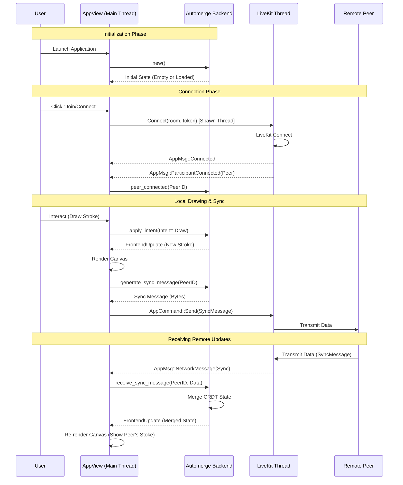

# General Application Flow Sequence Diagram

This diagram illustrates the high-level lifecycle of the application: initialization, connecting to a room, local user actions (drawing), and synchronization of events from remote peers.

