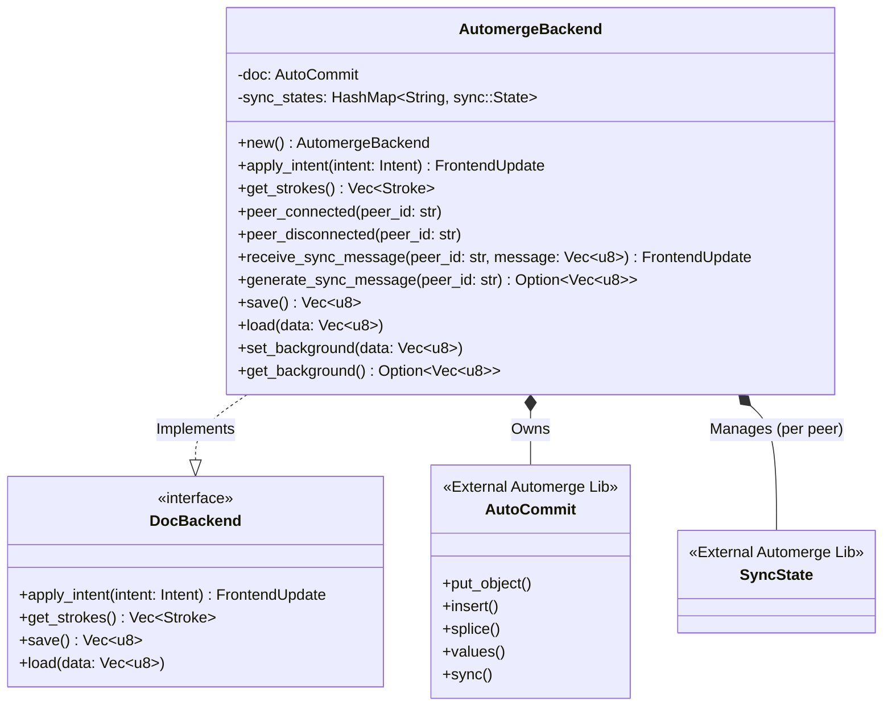

# Automerge Backend Class Diagram

```mermaid
classDiagram
    class AutomergeBackend {
        -doc: AutoCommit
        -sync_states: HashMap~String, sync::State~
        +new() AutomergeBackend
        +apply_intent(intent: Intent) FrontendUpdate
        +get_strokes() Vec~Stroke~
        +peer_connected(peer_id: str)
        +peer_disconnected(peer_id: str)
        +receive_sync_message(peer_id: str, message: Vec~u8~) FrontendUpdate
        +generate_sync_message(peer_id: str) Option~Vec~u8~~
        +save() Vec~u8~
        +load(data: Vec~u8~)
        +set_background(data: Vec~u8~)
        +get_background() Option~Vec~u8~~
    }

    class DocBackend {
        <<interface>>
        +apply_intent(intent: Intent) FrontendUpdate
        +get_strokes() Vec~Stroke~
        +save() Vec~u8~
        +load(data: Vec~u8~)
    }

    class AutoCommit {
        <<External Automerge Lib>>
        +put_object()
        +insert()
        +splice()
        +values()
        +sync()
    }

    class SyncState {
        <<External Automerge Lib>>
    }

    AutomergeBackend ..|> DocBackend : Implements
    AutomergeBackend *-- AutoCommit : Owns
    AutomergeBackend *-- SyncState : Manages (per peer)
```
