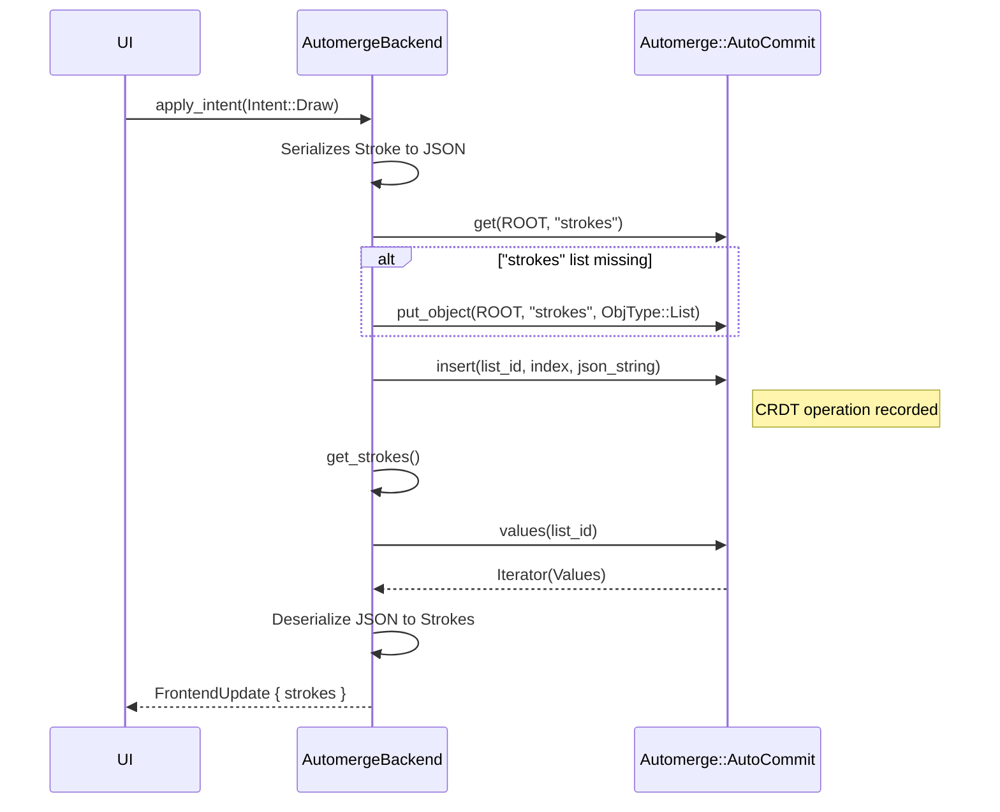

# Automerge Backend Local Actions Sequence

```mermaid
sequenceDiagram
    participant UI
    participant Backend as AutomergeBackend
    participant Doc as Automerge::AutoCommit

    UI->>Backend: apply_intent(Intent::Draw)
    
    Backend->>Backend: Serializes Stroke to JSON
    Backend->>Doc: get(ROOT, "strokes")
    
    alt "strokes" list missing
        Backend->>Doc: put_object(ROOT, "strokes", ObjType::List)
    end
    
    Backend->>Doc: insert(list_id, index, json_string)
    Note right of Doc: CRDT operation recorded
    
    Backend->>Backend: get_strokes()
    Backend->>Doc: values(list_id)
    Doc-->>Backend: Iterator(Values)
    
    Backend->>Backend: Deserialize JSON to Strokes
    Backend-->>UI: FrontendUpdate { strokes }
```
