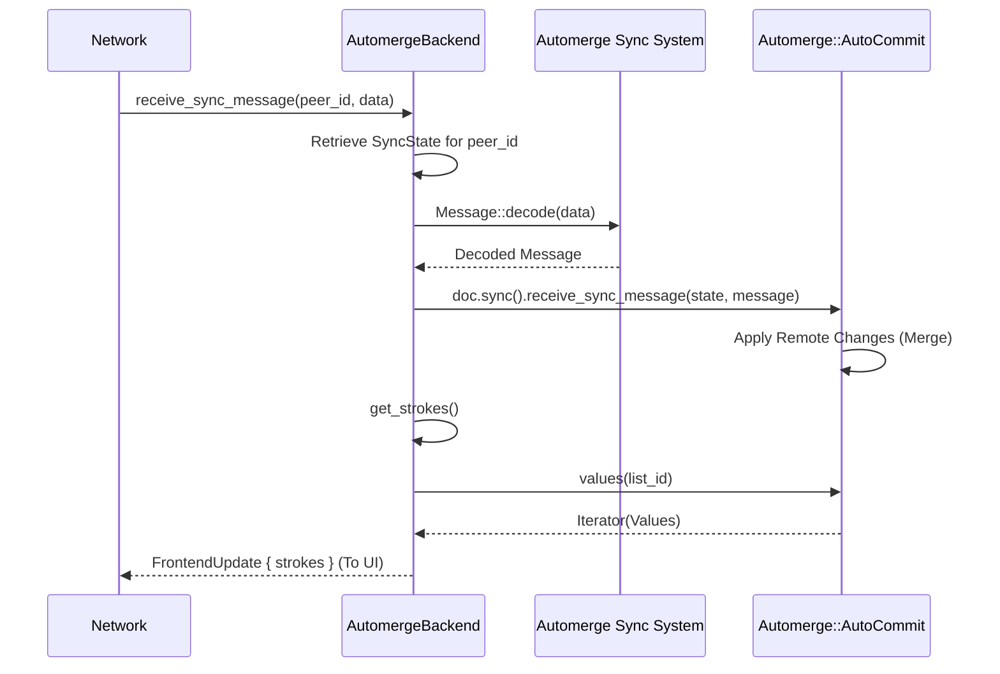

# Automerge Backend Sync Sequence

```mermaid
sequenceDiagram
    participant Network
    participant Backend as AutomergeBackend
    participant Sync as Automerge Sync System
    participant Doc as Automerge::AutoCommit

    Network->>Backend: receive_sync_message(peer_id, data)
    
    Backend->>Backend: Retrieve SyncState for peer_id
    
    Backend->>Sync: Message::decode(data)
    Sync-->>Backend: Decoded Message
    
    Backend->>Doc: doc.sync().receive_sync_message(state, message)
    Doc->>Doc: Apply Remote Changes (Merge)
    
    Backend->>Backend: get_strokes()
    Backend->>Doc: values(list_id)
    Doc-->>Backend: Iterator(Values)
    
    Backend-->>Network: FrontendUpdate { strokes } (To UI)
```
