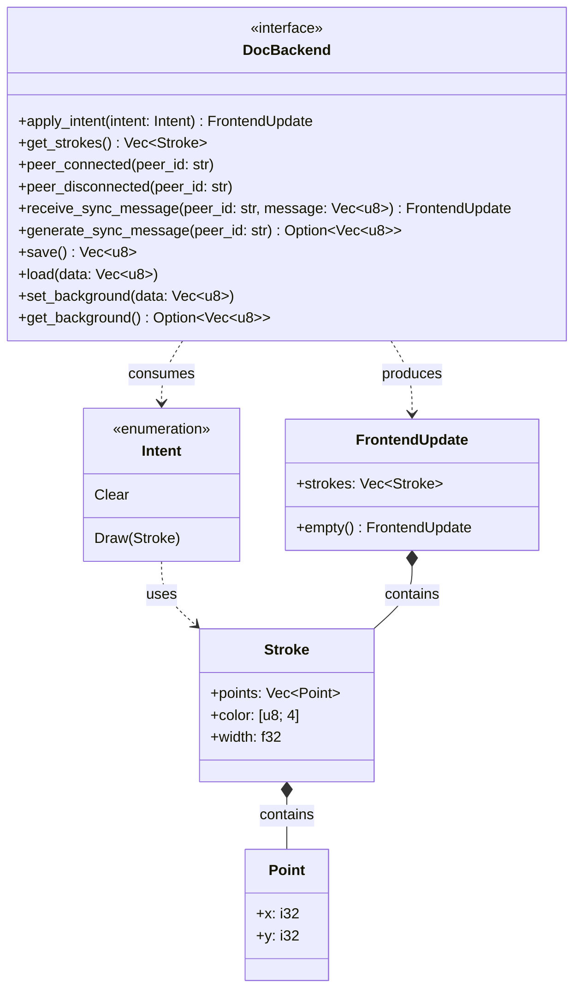

# Backend API Class Diagram

```mermaid
classDiagram
    class Point {
        +x: i32
        +y: i32
    }

    class Stroke {
        +points: Vec~Point~
        +color: [u8; 4]
        +width: f32
    }

    class Intent {
        <<enumeration>>
        Draw(Stroke)
        Clear
    }

    class FrontendUpdate {
        +strokes: Vec~Stroke~
        +empty() FrontendUpdate
    }

    class DocBackend {
        <<interface>>
        +apply_intent(intent: Intent) FrontendUpdate
        +get_strokes() Vec~Stroke~
        +peer_connected(peer_id: str)
        +peer_disconnected(peer_id: str)
        +receive_sync_message(peer_id: str, message: Vec~u8~) FrontendUpdate
        +generate_sync_message(peer_id: str) Option~Vec~u8~~
        +save() Vec~u8~
        +load(data: Vec~u8~)
        +set_background(data: Vec~u8~)
        +get_background() Option~Vec~u8~~
    }

    Stroke *-- Point : contains
    Intent ..> Stroke : uses
    FrontendUpdate *-- Stroke : contains
    DocBackend ..> Intent : consumes
    DocBackend ..> FrontendUpdate : produces
```
