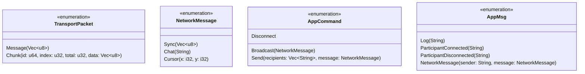

# Connectivity Class Diagram

All objects involved in the networking and synchronization layer of the collaborative editor.

```mermaid
classDiagram
    class TransportPacket {
        <<enumeration>>
        Message(Vec~u8~)
        Chunk(id: u64, index: u32, total: u32, data: Vec~u8~)
    }

    class NetworkMessage {
        <<enumeration>>
        Sync(Vec~u8~)
        Chat(String)
        Cursor(x: i32, y: i32)
    }

    class AppCommand {
        <<enumeration>>
        Disconnect
        Broadcast(NetworkMessage)
        Send(recipients: Vec~String~, message: NetworkMessage)
    }

    class AppMsg {
        <<enumeration>>
        Log(String)
        ParticipantConnected(String)
        ParticipantDisconnected(String)
        NetworkMessage(sender: String, message: NetworkMessage)
    }
```
