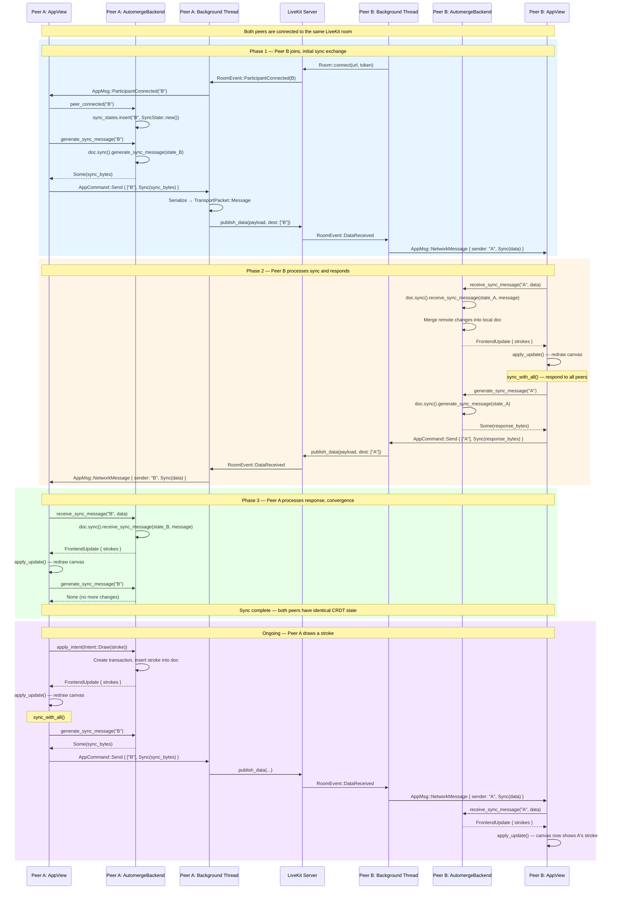

# Connectivity Sync Protocol Sequence

End-to-end synchronization flow showing how CRDT state is exchanged between two peers via the transport layer.

```mermaid
sequenceDiagram
    participant A_UI as Peer A: AppView
    participant A_BE as Peer A: AutomergeBackend
    participant A_BG as Peer A: Background Thread
    participant LK as LiveKit Server
    participant B_BG as Peer B: Background Thread
    participant B_BE as Peer B: AutomergeBackend
    participant B_UI as Peer B: AppView

    Note over A_UI, B_UI: Both peers are connected to the same LiveKit room

    rect rgb(230, 245, 255)
        Note over A_UI, B_UI: Phase 1 — Peer B joins, initial sync exchange
        B_BG->>LK: Room::connect(url, token)
        LK->>A_BG: RoomEvent::ParticipantConnected(B)
        A_BG->>A_UI: AppMsg::ParticipantConnected("B")
        A_UI->>A_BE: peer_connected("B")
        A_BE->>A_BE: sync_states.insert("B", SyncState::new())
        A_UI->>A_BE: generate_sync_message("B")
        A_BE->>A_BE: doc.sync().generate_sync_message(state_B)
        A_BE-->>A_UI: Some(sync_bytes)
        A_UI->>A_BG: AppCommand::Send { ["B"], Sync(sync_bytes) }
        A_BG->>A_BG: Serialize → TransportPacket::Message
        A_BG->>LK: publish_data(payload, dest: ["B"])
        LK->>B_BG: RoomEvent::DataReceived
        B_BG->>B_UI: AppMsg::NetworkMessage { sender: "A", Sync(data) }
    end

    rect rgb(255, 245, 230)
        Note over A_UI, B_UI: Phase 2 — Peer B processes sync and responds
        B_UI->>B_BE: receive_sync_message("A", data)
        B_BE->>B_BE: doc.sync().receive_sync_message(state_A, message)
        B_BE->>B_BE: Merge remote changes into local doc
        B_BE-->>B_UI: FrontendUpdate { strokes }
        B_UI->>B_UI: apply_update() — redraw canvas

        Note over B_UI: sync_with_all() — respond to all peers
        B_UI->>B_BE: generate_sync_message("A")
        B_BE->>B_BE: doc.sync().generate_sync_message(state_A)
        B_BE-->>B_UI: Some(response_bytes)
        B_UI->>B_BG: AppCommand::Send { ["A"], Sync(response_bytes) }
        B_BG->>LK: publish_data(payload, dest: ["A"])
        LK->>A_BG: RoomEvent::DataReceived
        A_BG->>A_UI: AppMsg::NetworkMessage { sender: "B", Sync(data) }
    end

    rect rgb(230, 255, 230)
        Note over A_UI, B_UI: Phase 3 — Peer A processes response, convergence
        A_UI->>A_BE: receive_sync_message("B", data)
        A_BE->>A_BE: doc.sync().receive_sync_message(state_B, message)
        A_BE-->>A_UI: FrontendUpdate { strokes }
        A_UI->>A_UI: apply_update() — redraw canvas

        A_UI->>A_BE: generate_sync_message("B")
        A_BE-->>A_UI: None (no more changes)
        Note over A_UI, B_UI: Sync complete — both peers have identical CRDT state
    end

    rect rgb(245, 230, 255)
        Note over A_UI, B_UI: Ongoing — Peer A draws a stroke
        A_UI->>A_BE: apply_intent(Intent::Draw(stroke))
        A_BE->>A_BE: Create transaction, insert stroke into doc
        A_BE-->>A_UI: FrontendUpdate { strokes }
        A_UI->>A_UI: apply_update() — redraw canvas

        Note over A_UI: sync_with_all()
        A_UI->>A_BE: generate_sync_message("B")
        A_BE-->>A_UI: Some(sync_bytes)
        A_UI->>A_BG: AppCommand::Send { ["B"], Sync(sync_bytes) }
        A_BG->>LK: publish_data(...)
        LK->>B_BG: RoomEvent::DataReceived
        B_BG->>B_UI: AppMsg::NetworkMessage { sender: "A", Sync(data) }
        B_UI->>B_BE: receive_sync_message("A", data)
        B_BE-->>B_UI: FrontendUpdate { strokes }
        B_UI->>B_UI: apply_update() — canvas now shows A's stroke
    end
```
