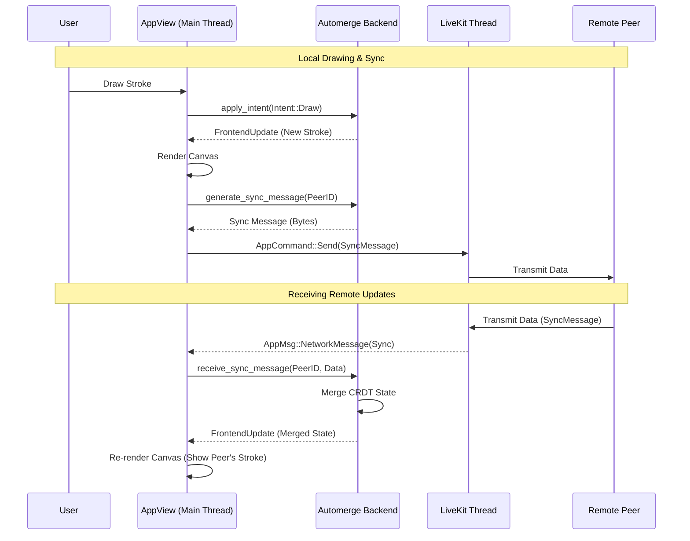

# Drawing and Sync Flow Sequence Diagram

This diagram illustrates the flow of a local drawing action and its synchronization with remote peers, as well as receiving and applying remote drawing updates.

