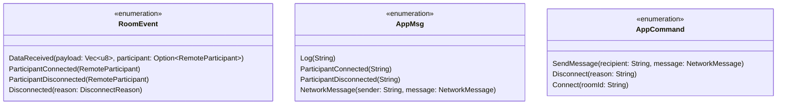

# RoomEvent Handling Diagram

How the background thread maps LiveKit `RoomEvent` variants to application messages (`AppMsg`).

```mermaid
classDiagram
    class RoomEvent {
        <<enumeration>>
        <<external - LiveKit SDK>>
        DataReceived(payload: Vec~u8~, participant: Option~RemoteParticipant~)
        ParticipantConnected(RemoteParticipant)
        ParticipantDisconnected(RemoteParticipant)
        Disconnected(reason: DisconnectReason)
    }

    class AppMsg {
        <<enumeration>>
        Log(String)
        ParticipantConnected(String)
        ParticipantDisconnected(String)
        NetworkMessage(sender: String, message: NetworkMessage)
    }

    class AppCommand {
        <<enumeration>>
        SendMessage(recipient: String, message: NetworkMessage)
        Disconnect(reason: String)
        Connect(roomId: String)
    }
```
