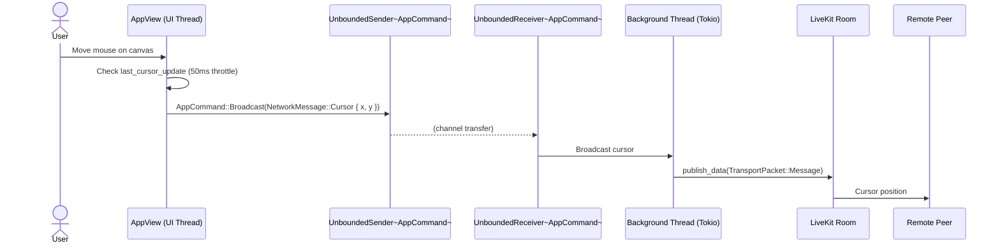

# Thread Communication — Cursor Broadcasting

Flow of broadcasting the local cursor position to all remote peers.

```mermaid
sequenceDiagram
    actor User
    participant UI as AppView (UI Thread)
    participant TxCmd as UnboundedSender~AppCommand~
    participant RxCmd as UnboundedReceiver~AppCommand~
    participant BG as Background Thread (Tokio)
    participant LK as LiveKit Room
    participant Peer as Remote Peer

    User->>UI: Move mouse on canvas
    UI->>UI: Check last_cursor_update (50ms throttle)
    UI->>TxCmd: AppCommand::Broadcast(NetworkMessage::Cursor { x, y })
    TxCmd-->>RxCmd: (channel transfer)
    RxCmd->>BG: Broadcast cursor
    BG->>LK: publish_data(TransportPacket::Message)
    LK->>Peer: Cursor position
```
