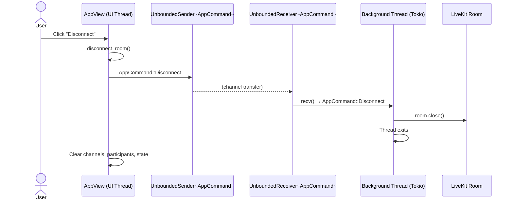

# Thread Communication — Disconnect

Flow when the local user disconnects from the LiveKit room.

```mermaid
sequenceDiagram
    actor User
    participant UI as AppView (UI Thread)
    participant TxCmd as UnboundedSender~AppCommand~
    participant RxCmd as UnboundedReceiver~AppCommand~
    participant BG as Background Thread (Tokio)
    participant LK as LiveKit Room

    User->>UI: Click "Disconnect"
    UI->>UI: disconnect_room()
    UI->>TxCmd: AppCommand::Disconnect
    TxCmd-->>RxCmd: (channel transfer)
    RxCmd->>BG: recv() → AppCommand::Disconnect
    BG->>LK: room.close()
    BG->>BG: Thread exits
    UI->>UI: Clear channels, participants, state
```
