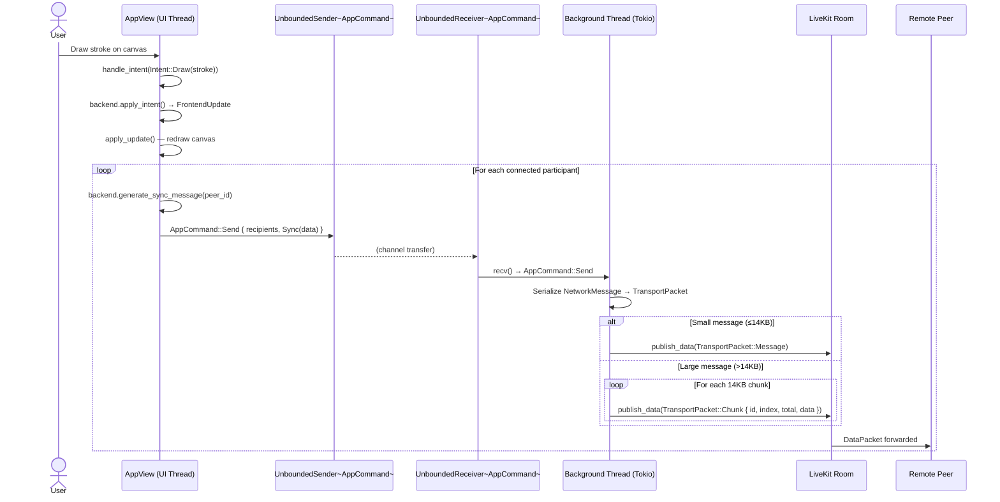

# Thread Communication — Local Drawing

Flow of a local drawing action from the UI thread through the network thread to remote peers.

```mermaid
sequenceDiagram
    actor User
    participant UI as AppView (UI Thread)
    participant TxCmd as UnboundedSender~AppCommand~
    participant RxCmd as UnboundedReceiver~AppCommand~
    participant BG as Background Thread (Tokio)
    participant LK as LiveKit Room
    participant Peer as Remote Peer

    User->>UI: Draw stroke on canvas
    UI->>UI: handle_intent(Intent::Draw(stroke))
    UI->>UI: backend.apply_intent() → FrontendUpdate
    UI->>UI: apply_update() — redraw canvas

    loop For each connected participant
        UI->>UI: backend.generate_sync_message(peer_id)
        UI->>TxCmd: AppCommand::Send { recipients, Sync(data) }
        TxCmd-->>RxCmd: (channel transfer)
        RxCmd->>BG: recv() → AppCommand::Send
        BG->>BG: Serialize NetworkMessage → TransportPacket
        alt Small message (≤14KB)
            BG->>LK: publish_data(TransportPacket::Message)
        else Large message (>14KB)
            loop For each 14KB chunk
                BG->>LK: publish_data(TransportPacket::Chunk { id, index, total, data })
            end
        end
        LK->>Peer: DataPacket forwarded
    end
```
