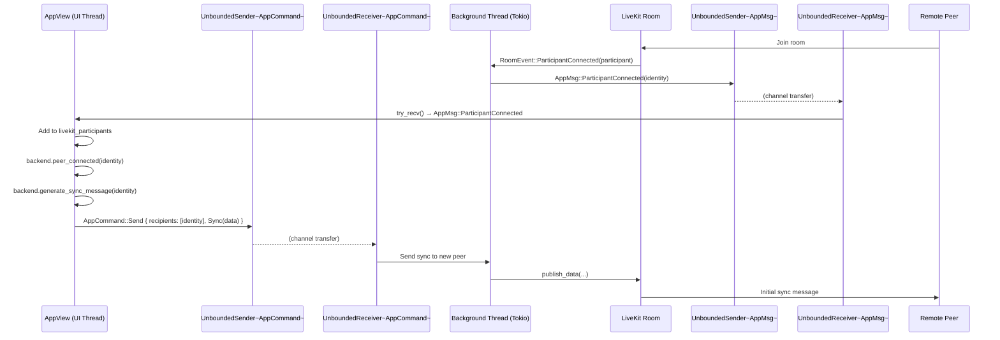

# Thread Communication — Participant Connects

Flow when a remote participant joins the LiveKit room and initial sync is exchanged.

```mermaid
sequenceDiagram
    participant UI as AppView (UI Thread)
    participant TxCmd as UnboundedSender~AppCommand~
    participant RxCmd as UnboundedReceiver~AppCommand~
    participant BG as Background Thread (Tokio)
    participant LK as LiveKit Room
    participant TxMsg as UnboundedSender~AppMsg~
    participant RxMsg as UnboundedReceiver~AppMsg~
    participant Peer as Remote Peer

    Peer->>LK: Join room
    LK->>BG: RoomEvent::ParticipantConnected(participant)
    BG->>TxMsg: AppMsg::ParticipantConnected(identity)
    TxMsg-->>RxMsg: (channel transfer)
    RxMsg->>UI: try_recv() → AppMsg::ParticipantConnected
    UI->>UI: Add to livekit_participants
    UI->>UI: backend.peer_connected(identity)
    UI->>UI: backend.generate_sync_message(identity)
    UI->>TxCmd: AppCommand::Send { recipients: [identity], Sync(data) }
    TxCmd-->>RxCmd: (channel transfer)
    RxCmd->>BG: Send sync to new peer
    BG->>LK: publish_data(...)
    LK->>Peer: Initial sync message
```
