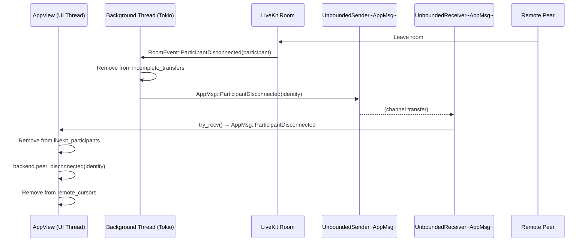

# Thread Communication — Participant Disconnects

Flow when a remote participant leaves the LiveKit room and local state is cleaned up.

```mermaid
sequenceDiagram
    participant UI as AppView (UI Thread)
    participant BG as Background Thread (Tokio)
    participant LK as LiveKit Room
    participant TxMsg as UnboundedSender~AppMsg~
    participant RxMsg as UnboundedReceiver~AppMsg~
    participant Peer as Remote Peer

    Peer->>LK: Leave room
    LK->>BG: RoomEvent::ParticipantDisconnected(participant)
    BG->>BG: Remove from incomplete_transfers
    BG->>TxMsg: AppMsg::ParticipantDisconnected(identity)
    TxMsg-->>RxMsg: (channel transfer)
    RxMsg->>UI: try_recv() → AppMsg::ParticipantDisconnected
    UI->>UI: Remove from livekit_participants
    UI->>UI: backend.peer_disconnected(identity)
    UI->>UI: Remove from remote_cursors
```
