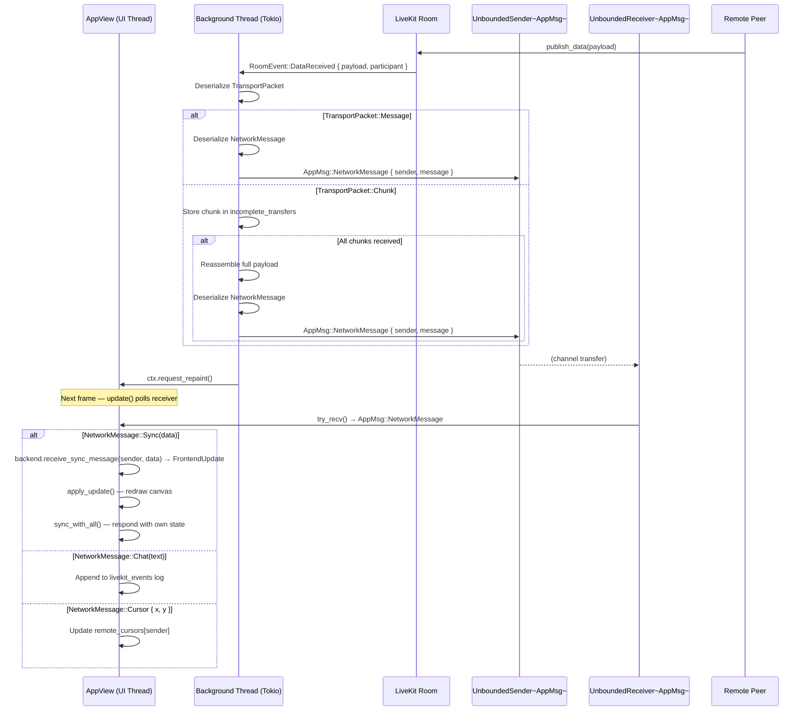

# Thread Communication — Receiving Remote Data

Flow of receiving data from a remote peer through the network thread to the UI thread.

```mermaid
sequenceDiagram
    participant UI as AppView (UI Thread)
    participant BG as Background Thread (Tokio)
    participant LK as LiveKit Room
    participant TxMsg as UnboundedSender~AppMsg~
    participant RxMsg as UnboundedReceiver~AppMsg~
    participant Peer as Remote Peer

    Peer->>LK: publish_data(payload)
    LK->>BG: RoomEvent::DataReceived { payload, participant }
    BG->>BG: Deserialize TransportPacket

    alt TransportPacket::Message
        BG->>BG: Deserialize NetworkMessage
        BG->>TxMsg: AppMsg::NetworkMessage { sender, message }
    else TransportPacket::Chunk
        BG->>BG: Store chunk in incomplete_transfers
        alt All chunks received
            BG->>BG: Reassemble full payload
            BG->>BG: Deserialize NetworkMessage
            BG->>TxMsg: AppMsg::NetworkMessage { sender, message }
        end
    end

    TxMsg-->>RxMsg: (channel transfer)
    BG->>UI: ctx.request_repaint()

    Note over UI: Next frame — update() polls receiver
    RxMsg->>UI: try_recv() → AppMsg::NetworkMessage

    alt NetworkMessage::Sync(data)
        UI->>UI: backend.receive_sync_message(sender, data) → FrontendUpdate
        UI->>UI: apply_update() — redraw canvas
        UI->>UI: sync_with_all() — respond with own state
    else NetworkMessage::Chat(text)
        UI->>UI: Append to livekit_events log
    else NetworkMessage::Cursor { x, y }
        UI->>UI: Update remote_cursors[sender]
    end
```
