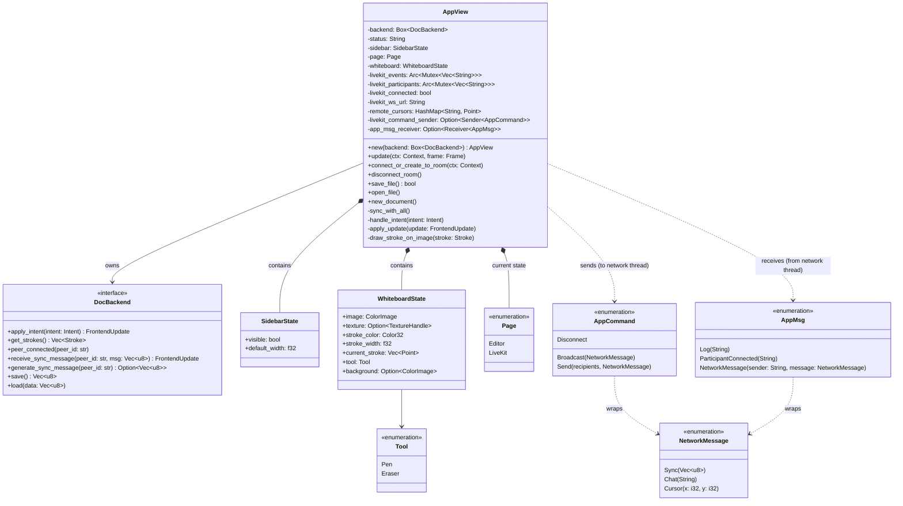

# UI Class Diagram

```mermaid
classDiagram
    class AppView {
        -backend: Box~DocBackend~
        -status: String
        -sidebar: SidebarState
        -page: Page
        -whiteboard: WhiteboardState
        -livekit_events: Arc~Mutex~Vec~String~~~
        -livekit_participants: Arc~Mutex~Vec~String~~~
        -livekit_connected: bool
        -livekit_ws_url: String
        -remote_cursors: HashMap~String, Point~
        -livekit_command_sender: Option~Sender~AppCommand~~
        -app_msg_receiver: Option~Receiver~AppMsg~~
        +new(backend: Box~DocBackend~) AppView
        +update(ctx: Context, frame: Frame)
        +connect_or_create_to_room(ctx: Context)
        +disconnect_room()
        +save_file() bool
        +open_file()
        +new_document()
        -sync_with_all()
        -handle_intent(intent: Intent)
        -apply_update(update: FrontendUpdate)
        -draw_stroke_on_image(stroke: Stroke)
    }

    class DocBackend {
        <<interface>>
        +apply_intent(intent: Intent) FrontendUpdate
        +get_strokes() Vec~Stroke~
        +peer_connected(peer_id: str)
        +receive_sync_message(peer_id: str, msg: Vec~u8~) FrontendUpdate
        +generate_sync_message(peer_id: str) Option~Vec~u8~~
        +save() Vec~u8~
        +load(data: Vec~u8~)
    }

    class SidebarState {
        +visible: bool
        +default_width: f32
    }

    class WhiteboardState {
        +image: ColorImage
        +texture: Option~TextureHandle~
        +stroke_color: Color32
        +stroke_width: f32
        +current_stroke: Vec~Point~
        +tool: Tool
        +background: Option~ColorImage~
    }

    class Tool {
        <<enumeration>>
        Pen
        Eraser
    }

    class Page {
        <<enumeration>>
        Editor
        LiveKit
    }

    class NetworkMessage {
        <<enumeration>>
        Sync(Vec~u8~)
        Chat(String)
        Cursor(x: i32, y: i32)
    }

    class AppCommand {
        <<enumeration>>
        Disconnect
        Broadcast(NetworkMessage)
        Send(recipients, NetworkMessage)
    }

    class AppMsg {
        <<enumeration>>
        Log(String)
        ParticipantConnected(String)
        NetworkMessage(sender: String, message: NetworkMessage)
    }

    AppView --> DocBackend : owns
    AppView *-- SidebarState : contains
    AppView *-- WhiteboardState : contains
    AppView *-- Page : current state
    WhiteboardState --> Tool
    AppCommand ..> NetworkMessage : wraps
    AppMsg ..> NetworkMessage : wraps
    AppView ..> AppCommand : sends (to network thread)
    AppView ..> AppMsg : receives (from network thread)
```
