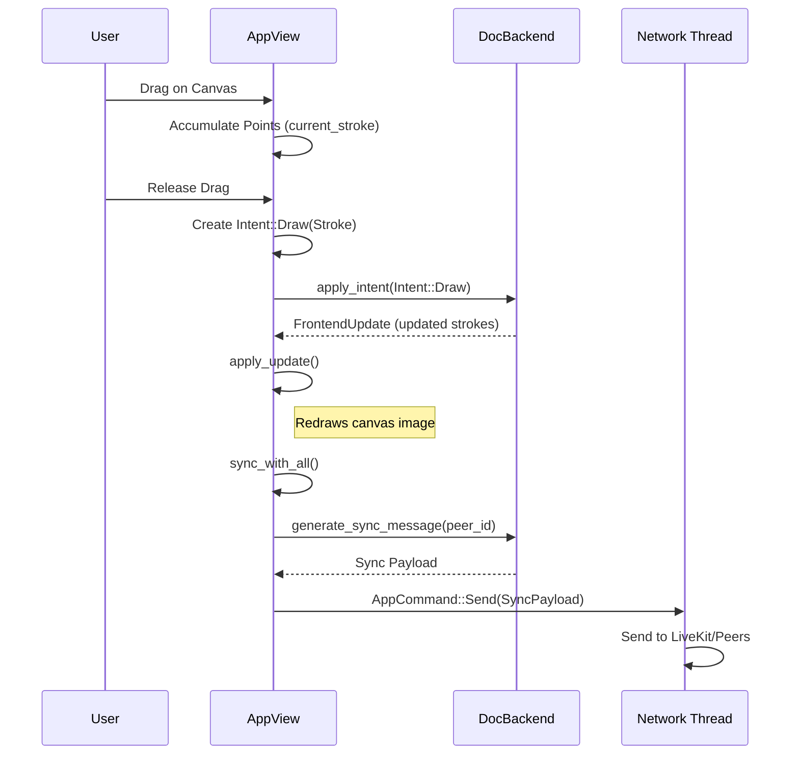

# UI Drawing Sequence Diagram

```mermaid
sequenceDiagram
    participant User
    participant AppView
    participant Backend as DocBackend
    participant Network as Network Thread

    User->>AppView: Drag on Canvas
    AppView->>AppView: Accumulate Points (current_stroke)
    
    User->>AppView: Release Drag
    AppView->>AppView: Create Intent::Draw(Stroke)
    
    AppView->>Backend: apply_intent(Intent::Draw)
    Backend-->>AppView: FrontendUpdate (updated strokes)
    
    AppView->>AppView: apply_update()
    note right of AppView: Redraws canvas image
    
    AppView->>AppView: sync_with_all()
    AppView->>Backend: generate_sync_message(peer_id)
    Backend-->>AppView: Sync Payload
    
    AppView->>Network: AppCommand::Send(SyncPayload)
    Network->>Network: Send to LiveKit/Peers
```
