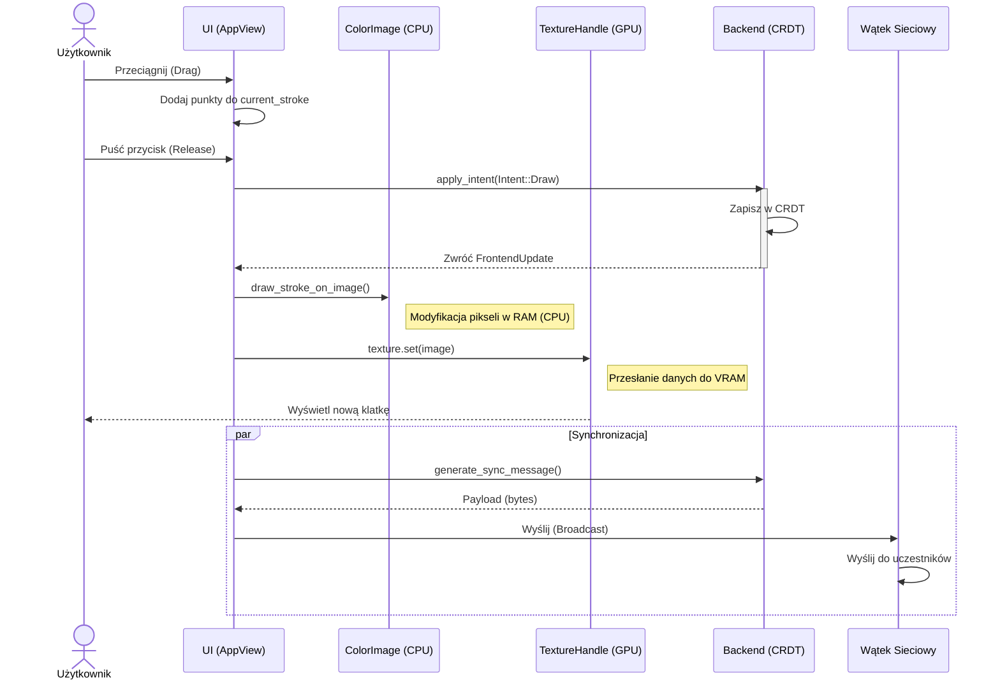

# Sekwencja Rysowania i Renderowania (PL)

Proces ten opisuje, jak ruch myszki przekłada się na obraz na ekranie oraz synchronizację sieciową.

## Opis Kroków

1. **Interakcja Użytkownika:**
   Użytkownik naciska przycisk myszy i przesuwa kursor po obszarze roboczym (Canvas). Aplikacja w czasie rzeczywistym zbiera współrzędne punktów do tymczasowego bufora `current_stroke`.

2. **Zakończenie Rysowania:**
   Użytkownik puszcza przycisk myszy, kończąc sekwencję rysowania. Aplikacja zamienia zebrane punkty na obiekt `Intent::Draw` i przekazuje go do warstwy logicznej.

3. **Przetwarzanie Backendowe (CRDT):**
   Warstwa `DocBackend` (Automerge) otrzymuje intencję i dodaje nową kreskę do struktury danych CRDT. Operacja ta zapewnia spójność danych i przygotowuje je do synchronizacji, zwracając jednocześnie obiekt `FrontendUpdate`.

4. **Rasteryzacja Obrazu (CPU):**
   Aplikacja odbiera `FrontendUpdate` i iteruje po wszystkich kreskach. Każda kreska jest "malowana" piksel po pikselu na buforze `egui::ColorImage` przechowywanym w pamięci RAM.

5. **Aktualizacja GPU (TextureHandle):**
   Po zmodyfikowaniu bufora pikseli, aplikacja wysyła go do pamięci karty graficznej (VRAM) za pomocą `TextureHandle`. Dzięki temu odświeżony obraz pojawia się na ekranie użytkownika w bieżącej klatce renderowania.

6. **Synchronizacja Sieciowa:**
   W tle aplikacja generuje komunikat synchronizacyjny (Sync Message) zawierający zmiany w strukturze CRDT. Komunikat ten jest wysyłany przez wątek sieciowy do serwera LiveKit, aby inni uczestnicy mogli zobaczyć nową kreskę.

## Diagram Sekwencji

