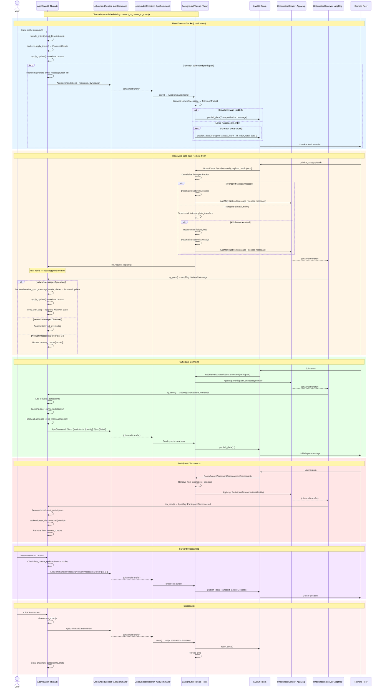

# UI Thread Communication Sequence

Detailed flow of messages between the UI thread and the background network thread during collaborative editing.

```mermaid
sequenceDiagram
    actor User
    participant UI as AppView (UI Thread)
    participant TxCmd as UnboundedSender~AppCommand~
    participant RxCmd as UnboundedReceiver~AppCommand~
    participant BG as Background Thread (Tokio)
    participant LK as LiveKit Room
    participant TxMsg as UnboundedSender~AppMsg~
    participant RxMsg as UnboundedReceiver~AppMsg~
    participant Peer as Remote Peer

    Note over UI, BG: Channels established during connect_or_create_to_room()

    rect rgb(230, 245, 255)
        Note over User, Peer: User Draws a Stroke (Local Intent)
        User->>UI: Draw stroke on canvas
        UI->>UI: handle_intent(Intent::Draw(stroke))
        UI->>UI: backend.apply_intent() → FrontendUpdate
        UI->>UI: apply_update() — redraw canvas

        loop For each connected participant
            UI->>UI: backend.generate_sync_message(peer_id)
            UI->>TxCmd: AppCommand::Send { recipients, Sync(data) }
            TxCmd-->>RxCmd: (channel transfer)
            RxCmd->>BG: recv() → AppCommand::Send
            BG->>BG: Serialize NetworkMessage → TransportPacket
            alt Small message (≤14KB)
                BG->>LK: publish_data(TransportPacket::Message)
            else Large message (>14KB)
                loop For each 14KB chunk
                    BG->>LK: publish_data(TransportPacket::Chunk { id, index, total, data })
                end
            end
            LK->>Peer: DataPacket forwarded
        end
    end

    rect rgb(255, 245, 230)
        Note over User, Peer: Receiving Data from Remote Peer
        Peer->>LK: publish_data(payload)
        LK->>BG: RoomEvent::DataReceived { payload, participant }
        BG->>BG: Deserialize TransportPacket

        alt TransportPacket::Message
            BG->>BG: Deserialize NetworkMessage
            BG->>TxMsg: AppMsg::NetworkMessage { sender, message }
        else TransportPacket::Chunk
            BG->>BG: Store chunk in incomplete_transfers
            alt All chunks received
                BG->>BG: Reassemble full payload
                BG->>BG: Deserialize NetworkMessage
                BG->>TxMsg: AppMsg::NetworkMessage { sender, message }
            end
        end

        TxMsg-->>RxMsg: (channel transfer)
        BG->>UI: ctx.request_repaint()

        Note over UI: Next frame — update() polls receiver
        RxMsg->>UI: try_recv() → AppMsg::NetworkMessage

        alt NetworkMessage::Sync(data)
            UI->>UI: backend.receive_sync_message(sender, data) → FrontendUpdate
            UI->>UI: apply_update() — redraw canvas
            UI->>UI: sync_with_all() — respond with own state
        else NetworkMessage::Chat(text)
            UI->>UI: Append to livekit_events log
        else NetworkMessage::Cursor { x, y }
            UI->>UI: Update remote_cursors[sender]
        end
    end

    rect rgb(230, 255, 230)
        Note over User, Peer: Participant Connects
        Peer->>LK: Join room
        LK->>BG: RoomEvent::ParticipantConnected(participant)
        BG->>TxMsg: AppMsg::ParticipantConnected(identity)
        TxMsg-->>RxMsg: (channel transfer)
        RxMsg->>UI: try_recv() → AppMsg::ParticipantConnected
        UI->>UI: Add to livekit_participants
        UI->>UI: backend.peer_connected(identity)
        UI->>UI: backend.generate_sync_message(identity)
        UI->>TxCmd: AppCommand::Send { recipients: [identity], Sync(data) }
        TxCmd-->>RxCmd: (channel transfer)
        RxCmd->>BG: Send sync to new peer
        BG->>LK: publish_data(...)
        LK->>Peer: Initial sync message
    end

    rect rgb(255, 230, 230)
        Note over User, Peer: Participant Disconnects
        Peer->>LK: Leave room
        LK->>BG: RoomEvent::ParticipantDisconnected(participant)
        BG->>BG: Remove from incomplete_transfers
        BG->>TxMsg: AppMsg::ParticipantDisconnected(identity)
        TxMsg-->>RxMsg: (channel transfer)
        RxMsg->>UI: try_recv() → AppMsg::ParticipantDisconnected
        UI->>UI: Remove from livekit_participants
        UI->>UI: backend.peer_disconnected(identity)
        UI->>UI: Remove from remote_cursors
    end

    rect rgb(245, 230, 255)
        Note over User, Peer: Cursor Broadcasting
        User->>UI: Move mouse on canvas
        UI->>UI: Check last_cursor_update (50ms throttle)
        UI->>TxCmd: AppCommand::Broadcast(NetworkMessage::Cursor { x, y })
        TxCmd-->>RxCmd: (channel transfer)
        RxCmd->>BG: Broadcast cursor
        BG->>LK: publish_data(TransportPacket::Message)
        LK->>Peer: Cursor position
    end

    rect rgb(255, 240, 240)
        Note over User, Peer: Disconnect
        User->>UI: Click "Disconnect"
        UI->>UI: disconnect_room()
        UI->>TxCmd: AppCommand::Disconnect
        TxCmd-->>RxCmd: (channel transfer)
        RxCmd->>BG: recv() → AppCommand::Disconnect
        BG->>LK: room.close()
        BG->>BG: Thread exits
        UI->>UI: Clear channels, participants, state
    end
```